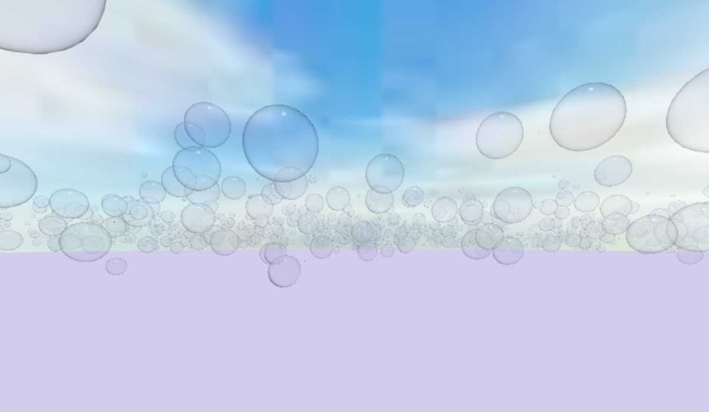
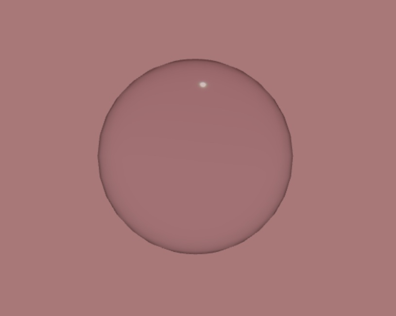

# Bubble Garden

### Bubbles! Lots and lots of bubbles!

# Description
Bubble garden is an interactive scene, where you can watch bubbles float, push them arround, or pop them. It is set up for both PC and VR interaction. Moving your mouse or VR controller near a bubble will push it away from you, and clicking or selecting will pop the bubble. All of the bubbles are floating in random directions, as well as being deformed based on noise. 

# Veiwing
To view this in your browser, click on the link: [Bubble_garden](https://s-o-m-e-o-n-ee.github.io/bubble_garden/)

# Visuals
## Sky

## Bubble

# Future Improvements
This project can be improved and expanded upon. The "wind" could be made more smooth and intuitive or the user could be able to move freely thoughout the scene. The deformation could also be smother and take into acount the size of the bubble. 

# Authors and acknowledgment
Sei Wilkinson created this as their final project for University of Massachusetts Boston CS460, [CS460.org](https://cs460.org/). 

Thank you to Professor Haehn for being a great professor and teaching everything needed for this project! Thank you as well to Avanith for assisting with previoise assignments that contributed to this one. 

The bubble material was heavily inspired by the example by drcmda at [codesandbox.io](https://codesandbox.io/p/sandbox/focused-kirch-9dyrgh?file=%2Fsrc%2FApp.js%3A5%2C11). 

Thank you to the Three.js comunity for all of the awsome examples, especially for VR!